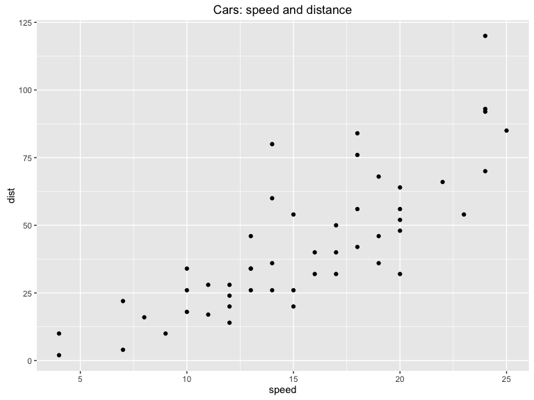
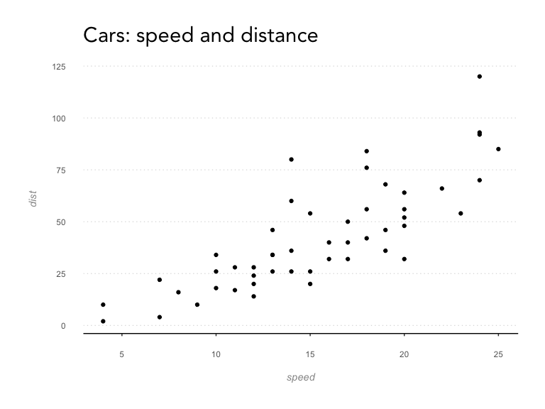
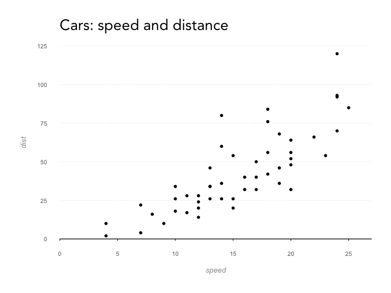
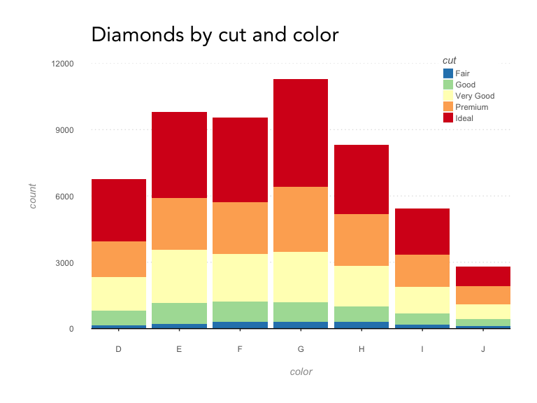
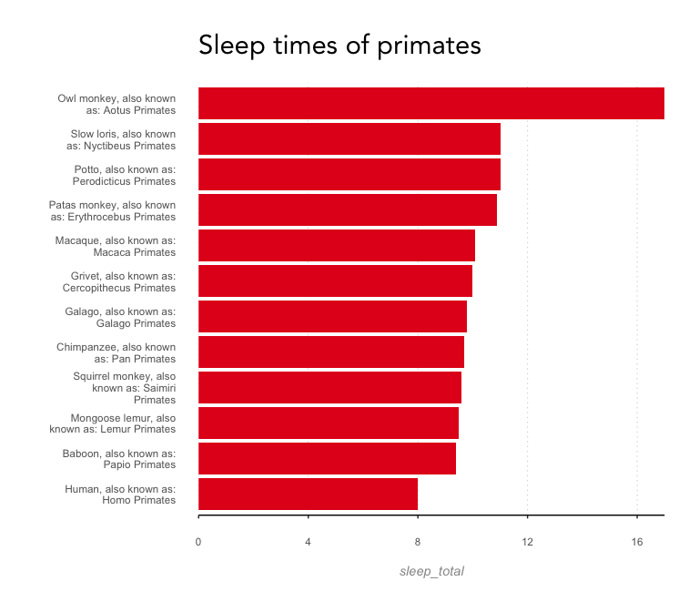

This document is an attempt to set up some basic graph elements for
ggplot2 that can be copied and pasted easily when creating new plots and
graphs.

Let's start with the basics:

    p <- ggplot(cars, aes(speed, dist)) +
      geom_point() +
      ggtitle("Cars: speed and distance")

    p #And plot it

Background and axes
-------------------

Now let's make it a little nicer and set up the background and axes

    bg_and_axes <-  theme(
      panel.background = element_rect(fill = NA),
      panel.grid.major.y = element_line(colour = "#cccccc", size = 0.3, linetype = "dotted"),
      panel.grid.major.x = element_blank(),
      axis.ticks.y = element_blank(),
      axis.line.x = element_line(color = "black", size = 0.5),
      axis.text = element_text(colour = "#666666"),
      axis.title = element_text(colour = "#999999", face = "italic"),
      axis.text.x = element_text(margin = margin(16,0,12,0)),
      axis.text.y = element_text(margin = margin(0,16,0,12)),
      plot.title = element_text(family = "Avenir", size = rel(2), 
                                margin = margin(0,6,24,6), hjust = 0),
      plot.margin = unit(c(1,1,1,1), "cm"))

    p + bg_and_axes

Scales
------

Set the scales properly:

    p2 <- p + bg_and_axes + 
      scale_y_continuous(limits = c(0,125), breaks = seq(0,125,25), expand = c(0,0)) +
      scale_x_continuous(limits = c(0,27), breaks = seq(0,25,5), expand = c(0,0))

    p2 #And plot our new graph

Bars and colors
---------------

Now to some bar charts and colors. I like the spectral color set because
it is easy to tell the colors apart, and works for the color blind too,
but it still has the feeling of matching colors.

    p3 <- ggplot(data = diamonds, aes(color, ..count.., fill=cut)) +
      geom_bar() +
      bg_and_axes +
      scale_y_continuous(limits = c(0,12000), expand = c(0,0)) +
      scale_x_discrete(expand = c(0,0)) +
      ggtitle("Diamonds by cut and color")

    legend_opts <- theme(
      legend.text = element_text(color = "#666666"),
      legend.title = element_text(color = "#666666", face = "italic"),
      legend.direction = "vertical",
      legend.position = c(0.9,0.9),
      legend.key.size = unit(12, "pt")
      )

    p3 +
      legend_opts +
      scale_fill_brewer(palette = "Spectral", direction = -1)

Now let's go from stacked bars to non-stacked, and flip 'm over, because
I always favor horizontal bars instead of vertical. It makes for easier
comparison, especially for longer lists, and improves readability of the
label text. Let's take a different data set and you'll see what I mean.

    #Make sure we have some long label names so you'll see how they wrap.
    msleep["full_name"] <- paste(msleep$name, ", also known as: ", 
                                 msleep$genus, msleep$order, sep = " ")

    #now for the plot.
    p4 <- ggplot(msleep[msleep$order == "Primates",], aes(reorder(full_name, sleep_total), sleep_total)) +
      geom_bar(stat="identity", fill=brewer.pal(3, "Set1")[1]) +
      scale_x_discrete(labels = function(x) str_wrap(x, width = 25)) +
      scale_y_continuous(expand = c(0,0)) +
      coord_flip()

    p4 +
      bg_and_axes +
      ggtitle("Sleep times of primates")

